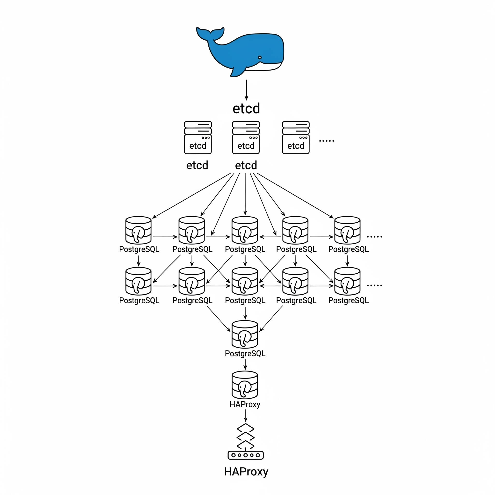
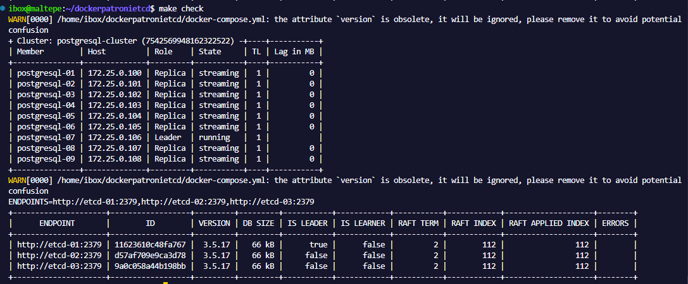

# dockerpatroni — Quick Usage

This repository is designed to easily launch a high availability (HA) cluster based on PostgreSQL + Patroni + etcd using Docker Compose.

This README focuses on the simple Makefile-based workflow you will use most often: `make up` / `make down` and `.env` preparation.

# Architecture

The following diagram shows the cluster topology and component interactions (etcd, Patroni, PostgreSQL nodes, HAProxy):



Figure: Component diagram — etcd cluster, Patroni-managed PostgreSQL nodes, and HAProxy in front of Postgres.

## Quick Commands

- `make gen`    — Builds and runs the generator image (produces: `docker-compose.yml`, `haproxy.cfg`).
- `make up`     — Starts the main stack (build + up -d). The most common command.
- `make down`   — Stops the stack and removes volumes.
- `make regen`  — Reruns the generator using the current `.env` (configs are regenerated).
- `make set-nodes N=3` — Changes the `NUMBER_OF_CLUSTER` value inside `.env` (afterwards `make regen` is recommended).
- `make check`  — Runs simple cluster checks (patronictl, etcdctl).

In most cases, the only two commands you need are:

- `make up`   — Start the cluster.
- `make down` — Stop the entire stack.

## How to Prepare `.env`

At the repository root, there is a `.env` file. For a basic setup, you can edit the existing `.env` or copy it and create your own version.

### Example (Minimal, Required Fields):

```
POSTGRES_PASSWORD=securepassword123
REPLICATOR_PASSWORD=replicatorpassword123
HAPROXY_NAME=haproxy
HAPROXY_IP=172.25.0.100
HAPROXY_FRONTEND_READWRITE=5000
HAPROXY_FRONTEND_READONLY=5001
HAPROXY_STATS_PORT=8404
POSTGRES_PORT=5432
PATRONI_PORT=8008
ETCD_CLIENT_PORT=2379
ETCD_PEER_PORT=2380
NUMBER_OF_POSTGRES_CLUSTER=3
NUMBER_OF_ETCD_CLUSTER=3
```

### Notes:
- You can control the number of nodes with `NUMBER_OF_POSTGRES_CLUSTER` and `NUMBER_OF_ETCD_CLUSTER`.
- After making changes in `.env` (especially if you change node counts or names), run `make regen` or `make gen`; these commands regenerate files like `docker-compose.yml` and `haproxy.cfg` in `configs/`.

## Typical Workflow

1. Prepare or edit your `.env` file.
2. (If needed) run `make gen` or `make regen` to generate configuration files.
3. Run `make up` to start the cluster in the background.
4. Check status with `make check` or watch services via `docker compose logs -f`.
5. Run `make down` to shut down everything.

## Example: Quick Local Startup

```
# dockerpatroni — Quick Reference

This repository provides a Docker Compose setup for a PostgreSQL + Patroni + etcd high-availability cluster.

The README contains project-specific instructions: Makefile commands, `.env` hints, and quick checks for Patroni/etcd/HAProxy.
```

## Project-Specific Checks & Troubleshooting

### Configuration Regeneration
- If you changed node counts or topology in `.env`:

  ```
  make set-nodes N=3
  make regen
  ```

### Patroni and etcd Checks
- Patroni cluster list:

  ```
  docker compose exec postgresql-01 /usr/local/bin/patronictl -c /etc/patroni/config.yml list
  ```

- etcd endpoints status (example):

  ```
  ENDPOINTS=$(printf "http://%s:2379," etcd-01 etcd-02 etcd-03); ENDPOINTS=${ENDPOINTS%,}; etcdctl --endpoints="$ENDPOINTS" endpoint status --write-out=table
  ```

### HAProxy
- HAProxy stats are exposed on `HAPROXY_STATS_PORT` (e.g. `8404`). Open `http://<HAPROXY_HOST>:<HAPROXY_STATS_PORT>` to view.

### Logs and Containers
- Postgres node logs: `docker compose logs -f postgresql-01`
- HAProxy logs: `docker compose logs -f haproxy`

### Config Changes Applied While Containers Are Running
- If configs were regenerated, prefer `docker compose down -v` then `make up` to ensure containers pick up the new configs.

### Short Note on `make check`
- `make check` runs quick Patroni/etcd validations useful for CI or manual verification.

## Example Output for `make check`

For the configuration with `NUMBER_OF_POSTGRES_CLUSTER=9` and `NUMBER_OF_ETCD_CLUSTER=3`, the following is an example output:



## Files (Short)

- `Makefile` — Main project commands (`gen`, `up`, `down`, `regen`, `set-nodes`, `check`).
- `docker-compose.generator.yml` — Generator service that renders configs.
- `docker-compose.yml` — Generated Compose file used to run the stack.
- `configs/` — Templates and generated config files.
